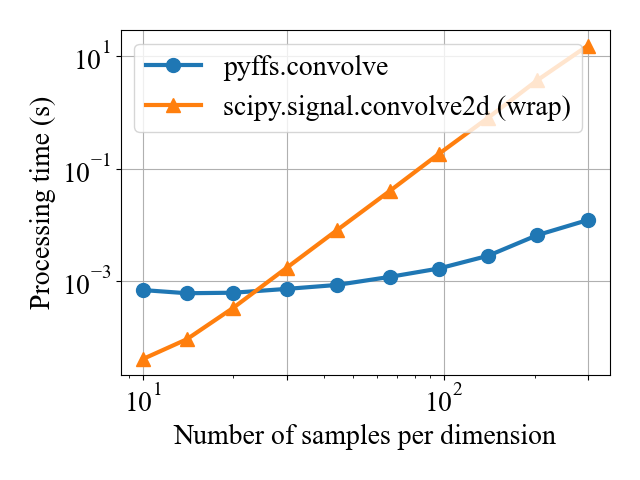
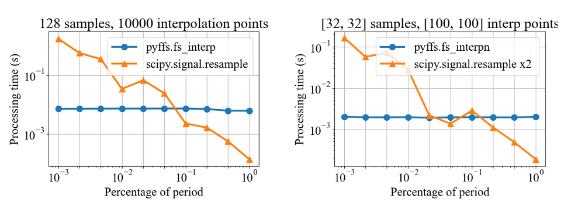
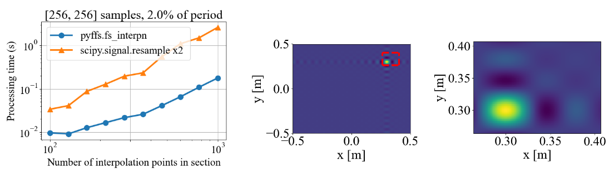
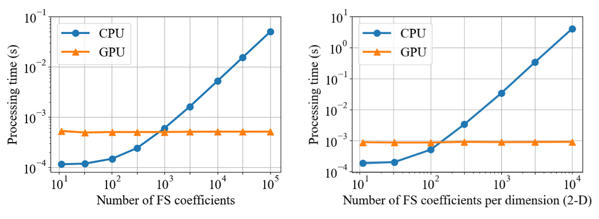
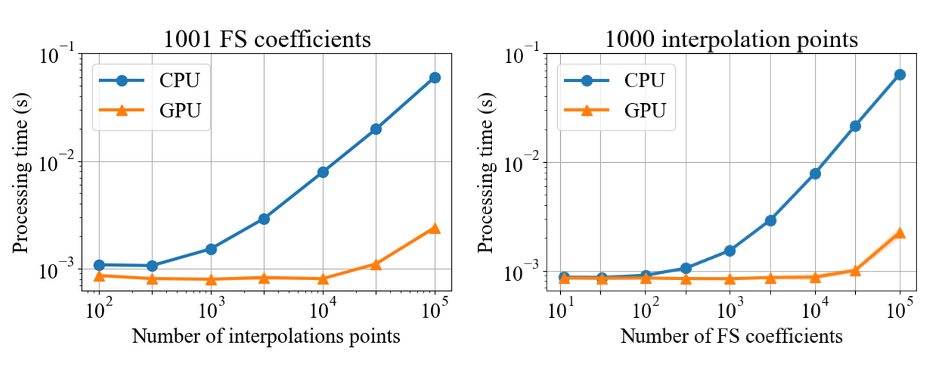
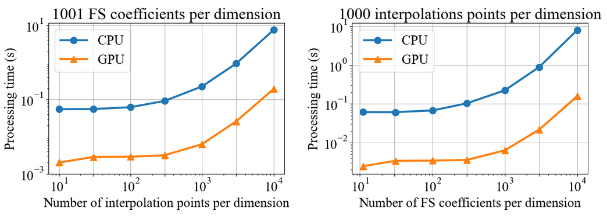
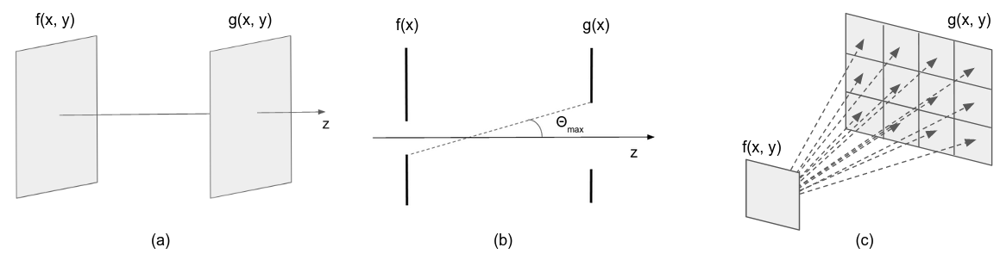

# Summary

Fourier transforms are an often necessary component in many computational tasks,
and can be approximated efficiently through the *Fast Fourier Transform (FFT)* 
algorithm [@Cooley1965]. However, many applications involve an underlying 
continuous signal, and a more natural choice would be to work with e.g. the 
*Fourier series (FS)* coefficients in order to avoid the additional overhead of 
translating between the analog and discrete domains. Unfortunately, there exists
very little literature and tools for the manipulation of FS coefficients from 
discrete samples in practice. This paper introduces a Python 3 library called 
*pyFFS* for efficient FS coefficient computation, convolution, and interpolation 
for N-D signals. 
While the libraries SciPy [@Virtanen2020] and NumPy [@Harris2020] provide 
efficient routines for *discrete Fourier transform (DFT)* coefficients via the FFT 
algorithm, pyFFS addresses the computation of FS coefficients through what we 
call the *Fast Fourier Series (FFS)*. Moreover, pyFFS includes an FS interpolation
method based on the *chirp Z-transform (CZT)* [@rabiner1969chirp] that can make it
more than an order of magnitude faster than the SciPy equivalent when one wishes
to perform distortionless bandlimited interpolation. GPU support through the 
CuPy library [@Okuta2017] is readily available, and allows for further acceleration: an order of 
magnitude faster for computing the 2-D FS coefficients of $1000\times1000$ 
samples and nearly two orders of magnitude faster for 2-D interpolation. 


# Statement of need
While deceptively simple, the FFS algorithm presented in this paper is 
surprisingly neither described in signal processing textbooks nor implemented in
numerical computing libraries. For example, NumPy and SciPy in the Python 
ecosystem focus mainly on the DFT and related operations. We aim to change this 
by providing an efficient and easy-to-use interface to the FFS algorithm via our
Python package pyFFS. 
The main motivation for working with pyFFS rather than the FFT routines from NumPy/SciPy is 
convenience when working with continuous-domain compactly-supported signals. The philosophy of pyFFS
is to retain the continuous-domain perspective, often neglected when using 
numerical libraries such as NumPy and SciPy, which allows for much clearer code
(as will be shown in a Fourier optics example). This can also prevent common pitfalls
due to an invalid conversion between discrete and continuous domains (e.g. 
spectral leakage, aliasing, periodisation artefacts, etc). 
As well as convenient, pyFFS is also extremely efficient. We benchmark pyFFS 
with equivalent functions in SciPy, observing scenarios in which the proposed 
library is more than an order of magnitude faster, i.e. for 2-D convolution and 
for interpolation. Moreover, GPU support has been seamlessly incorporated for an
even faster implementation. Just as the FFT implementation via NumPy and SciPy 
can be readily used for an efficient $\mathcal{O}(N\log N)$ analysis and synthesis of discrete sequences, 
pyFFS offers the same ease-of-use and performance capabilities for discrete
representations of continuous-domain signals, along with faster interpolation
techniques.

pyFFS has been used in [@fageot2020tv], where the authors make use of the
FFS algorithm to efficiently compute multidimensional periodic splines. It is 
currently being investigated in radio-astronomy and optics projects, in which physical 
processes have been modeled as bandlimited. In general, pyFFS is useful for 
interpolating multidimensional functions efficiently. Such functions are 
commonplace in numerous applications, e.g. radio-astronomy, medical imaging, 
holography, etc. Finally, Fourier Series are an important component of the
*Non Uniform Fast Fourier Transform (NUFFT)*, extensively used in MRI imaging 
and other computational imaging modalities [@barnett2019parallel]. 

# Algorithms 

In this section, we provide for reference the main definitions and results 
leveraged in pyFFS. For simplicity, the results are provided in the context of 
1-D sequences, but pyFFS also offers N-D versions of the various algorithms/transforms below.
As the purpose of this paper is to present the library, how to use it, and some
benchmarking results, we refer to [@bezzam2021pyffs]
for mathematical presentations and proofs of the FFS algorithm and the CZT-based
interpolation.

[comment]: <> (## The Discrete Fourier Transform )

[comment]: <> (Let $\mathbf{x} \in \mathbb{C}^{N}$. The length-$N$ *Discrete Fourier Transform* $\text{DFT}_{N}\{\mathbf{x}\} \in \mathbb{C}^{N}$ is)

[comment]: <> (defined as [@vetterli2014foundations]:)

[comment]: <> ($$\text{DFT}_{N}\{\mathbf{x}\}[k] = \sum_{n = 0}^{N - 1} \mathbf{x}[n] W_{N}^{n k}, \qquad  k \in \{ 0, \ldots, N - 1 \},$$)

[comment]: <> (with $W_{N} = \exp\left&#40; -j \frac{2 \pi}{N} \right&#41;$.)

[comment]: <> (The length-$N$ *inverse Discrete Fourier Transform* $\text{iDFT}_{N}\{\mathbf{x}\} \in \mathbb{C}^{N}$ is defined as:)

[comment]: <> ($$\text{iDFT}_{N}\{\mathbf{x}\}[n] = \frac{1}{N} \sum_{k = 0}^{N - 1} \mathbf{x}[k] W_{N}^{-n k}, \qquad n \in \{ 0, \ldots, N - 1 \}.$$)

[comment]: <> ([comment]: <> &#40;Moreover, $\text{&#40;i&#41;DFT}_{N}$ is reversible:&#41;)

[comment]: <> ([comment]: <> &#40;$$&#40;\text{iDFT}_{N} \circ \text{DFT}_{N}&#41;\{\mathbf{x}\} = &#40;\text{DFT}_{N} \circ \text{iDFT}_{N}&#41;\{\mathbf{x}\} = \mathbf{x}.$$&#41;)

[comment]: <> (The FFT [@Cooley1965] is a particularly efficient  $\mathcal{O}&#40;N \log N&#41;$ algorithm to compute)

[comment]: <> ($\text{&#40;i&#41;DFT}_{N}$, especially if $N$ is highly composite.)

[comment]: <> (## The Chirp Z-Transform )

[comment]: <> (Let $\mathbf{x} \in \mathbb{C}^{N}$. The length-$M$ *Chirp Z-Transform* )

[comment]: <> ($\text{CZT}_{N}^{M}\{\mathbf{x}\} \in \mathbb{C}^{M}$ of parameters $A, W \in \mathbb{C}^{*}$ is)

[comment]: <> (defined as:)

[comment]: <> ($$\text{CZT}_{N}^{M}\{ \mathbf{x} \}[k] = \sum_{n = 0}^{N - 1} \mathbf{x}[n] A^{-n} W^{n k}, \qquad k \in \{ 0, \ldots, M - 1 \}.$$)

[comment]: <> (The CZT is a generalization of the DFT which samples the $Z$ plane at uniformly-spaced points along the unit circle. It can be efficiently computed using can be efficiently computed using the $\text{DFT}$ and $\text{iDFT}$ in $\mathcal{O}&#40;L \log L&#41;$)

[comment]: <> (operations, where $L \ge N + M - 1$. This is done via Bluestein's algorithm [@Bluestein1970]. A similar formulation of the CZT and its efficient computation is known as the fast fractional FT algorithm [@Bailey1991].)

## Fast Fourier Series

Let $x: \mathbb{R} \to \mathbb{C}$ be a $T$-periodic function of *bandwidth*
$N_{FS} = 2 N + 1$.  Then $x$ is fully characterized by its $N_{FS}$ *Fourier
Series* coefficients $\{X_{k}^{FS}, k = -N, \ldots, N\}$ [@vetterli2014foundations]

$$x(t) = \sum_{k = -N}^{N} X_{k}^{FS} \exp\left( j \frac{2 \pi}{T} k t \right),$$

where the FS coefficients $\{X_{k}^{FS}, k = -N, \ldots, N\}$ are defined as

$$ X_{k}^{FS} = \frac{1}{T} \int_{T_{c} - \frac{T}{2}}^{T_{c} + \frac{T}{2}} x(t) \exp\left( -j \frac{2 \pi}{T} k t \right) dt \tag{1},$$

with $T_{c}$ being one of $x$'s period mid-points.

Computing the $X_{k}^{FS}$ with (1) can be prohibitive when closed-form solutions
are unavailable.  However, it is possible to calculate the FS coefficients exactly from $N_{s}=N_{FS}+Q$ judiciously-placed samples of $x$, where $Q \in 2\mathbb{N}$ is
some arbitrary *zero-padding*. Then, 

$$\mathbf{x}  = N_{s} \; \text{iDFT}_{N_{s}}\left\{ \mathbf{X}^{FS} \odot \exp\left( j \frac{2 \pi}{T} T_{c} \right)^{\mathbf{E}_{1}} \right\} \odot \exp\left( -j \frac{2 \pi}{N_{s}} \right)^{N \mathbf{E}_{2}},$$

$$\mathbf{X}^{FS}  = \frac{1}{N_{s}} \text{DFT}_{N_{s}}\left\{ \mathbf{x} \odot \exp\left( -j \frac{2 \pi}{N_{s}} \right)^{- N \mathbf{E}_{2}} \right\} \odot \exp\left( j \frac{2 \pi}{T} T_{c} \right)^{- \mathbf{E}_{1}},$$

where $\text{DFT}_{N}\{\mathbf{x}\} \in \mathbb{C}^{N}$ and 
$\text{iDFT}_{N}\{\mathbf{x}\} \in \mathbb{C}^{N}$ are the length-$N$ *Discrete Fourier Transform*
and *inverse Discrete Fourier Transform* respectively [@vetterli2014foundations], and

$$\mathbf{x}  = \left[ x(t_0), \ldots, x(t_{M}), x(t_{-M}), \ldots, x(t_{-1}) \right] \in \mathbb{C}^{N_{s}},$$ 

$$\mathbf{X}^{FS}  = \left[ X_{-N}^{FS}, \ldots, X_{N}^{FS}, \mathbf{0}_Q \right] \in \mathbb{C}^{N_{s}},\qquad  t_n  = T_{c} + \frac{T}{N_{s}} n, \quad n \in\mathbb{N},$$

$$\mathbf{E}_{1}  = \left[ -N, \ldots, N, \mathbf{0}_Q \right] \in \mathbb{Z}^{N_{s}}, \qquad\mathbf{E}_{2}  = \left[ 0, \ldots, (N_s-1)/2, -(N_s-1)/2, \ldots, -1 \right] \in \mathbb{Z}^{N_{s}}.$$

The FFT [@Cooley1965] is a particularly efficient  $\mathcal{O}(N \log N)$ algorithm to compute
$\text{(i)DFT}_{N}$, especially if $N$ is highly composite. As the (i)DFT is a 
core component, FFS can be computed
with similar efficency. A proof of this result as well as the case $Q\in 2\mathbb{N}+1$ is available in [@bezzam2021pyffs].

## Fast Interpolation of FS Coefficients
Let $0\leq a < b\leq T\in \mathbb{R}$ be the end-points of an interval on which we want to evaluate
$M$ equi-spaced samples of $x$. Then
$$\mathbf{x} = A^{N} \text{CZT}_{N_{FS}}^{M}(\mathbf{X}^{FS}) \odot W^{-N \mathbf{E}},$$

where $\text{CZT}_{N}^{M}\{\mathbf{x}\} \in \mathbb{C}^{M}$ is the length-$M$ *Chirp Z-Transform* 
of parameters $A, W \in \mathbb{C}^{*}$ defined as

$$\text{CZT}_{N}^{M}\{ \mathbf{x} \}[k] = \sum_{n = 0}^{N - 1} \mathbf{x}[n] A^{-n} W^{n k}, \qquad k \in \{ 0, \ldots, M - 1 \},$$
and
$$\mathbf{x} = [x(t_{0}), \ldots, x(t_{M-1})] \in \mathbb{C}^{M}$$
$$\mathbf{X}^{FS}  = \frac{1}{N_{s}} \text{DFT}_{N_{s}}\left\{ \mathbf{x} \odot \exp\left( -j \frac{2 \pi}{N_{s}} \right)^{- N \mathbf{E}_{2}} \right\} \odot \exp\left( j \frac{2 \pi}{T} T_{c} \right)^{- \mathbf{E}_{1}},$$
$$t_{n} = a + \frac{b - a}{M - 1} n, \quad n \in \{0,\ldots, M-1\},$$
$$A = \exp\left(-j \frac{2\pi}{T} a\right),\qquad W = \exp\left(j \frac{2 \pi}{T} \frac{b - a}{M - 1}\right),\qquad \mathbf{E} = [0, \ldots, M -1] \in \mathbb{N}^{M}.$$

The CZT is a generalization of the DFT which samples the $Z$ plane at 
uniformly-spaced points along the unit circle. It can be efficiently computed 
using the $\text{DFT}$ and $\text{iDFT}$ in $\mathcal{O}(L \log L)$
operations, where $L \ge N + M - 1$. This is done via Bluestein's algorithm 
[@Bluestein1970].

With the above result, one can interpolate sub-sections of a period efficiently. 
Moreover, it is possible to perform DFTs of a smaller length than what would be 
normally required with a more standard iDFT interpolation approach, namely zero-padding
the DFT coefficients and taking a longer iDFT for an increase in temporal
resolution across the entire period. As the CZT is the most expensive operation,
the above interpolation has the same complexity. Again, the proof of this result is 
available in [@bezzam2021pyffs].

# pyFFS Overview and Usage

pyFFS is a Python library for performing efficient and distortionless FS coefficient computation, convolution, and interpolation for periodic/compactly-supported, bandlimited signals. The goal is to provide an intuitive tool to numerically work with such signals of any dimension $ D $. Just as the FFT functions from NumPy and SciPy can be used without too much thought about the internal details, we have created a a user interface for FS computations that can also be used out-of-the-box for the appropriate scenario.


## Fourier series analysis and synthesis

The user interface for 1-D functions is shown below. Note that the samples 
provided to `ffs` are not in chronological order (see previous section). The method `ffs_sample` 
returns the timestamps and indices necessary for ensuring the samples provided 
to `ffs` are in the expected order.

```python
# determine appropriate timestamps and indices for rearranging input
sample_points, idx = pyffs.ffs_sample(
  T,      # function period
  N_FS,   # function bandwidth, i.e. number of FS coefficients (odd)
  T_c,    # function center
  N_s     # number of samples
)

# sample a known function at the correctly ordered timestamps
x = pyffs.func.dirichlet(sample_points, T, T_c, N_FS)
# OR rearrange ordered samples using `idx`
# x = x_orig[idx]

# compute FS coefficients 
x_FS = pyffs.ffs(x, T, T_c, N_FS)

# back to samples with inverse transform
x_r = pyffs.iffs(x_FS, T, T_c, N_FS)    # equivalent to x
```

The user interface for the general N-D case is shown below, with the specific 
example of 2-D. As in the 1-D case, samples provided to `ffsn` are not in 
increasing order of the input variables. The method `ffsn_sample` returns the 
locations and indices necessary for making sure the samples provided to `ffsn`
are in the expected order. Alternatively, the method `ffs_shift` can be used to
reorder the samples.

```python
T = [T_x, T_y]         # list of periods for each dimension
T_c = [T_cx, T_cy]     # list of function centers for each dimension
N_FS = [N_FSx, N_FSy]  # list of function bandwidths for each dimension
N_s = [N_sx, N_sy]     # number of samples per dimension

# determine appropriate timestamps and indices for rearranging input
sample_points, idx = pyffs.ffsn_sample(T=T, N_FS=N_FS, T_c=T_c, N_s=N_s)

# sample a known function at the correctly ordered timestamps
x = pyffs.func.dirichlet_2D(sample_points, T, T_c, N_FS)
# OR rearrange ordered samples
# x = pyffs.ffs_shift(x_orig)

# compute FS coefficients 
x_FS = pyffs.ffsn(x, T=T, T_c=T_c, N_FS=N_FS)

# go back to samples
x_r = pyffs.iffsn(x_FS, T=T, T_c=T_c, N_FS=N_FS)    # equivalent to x
```

## Circular convolution

The user interface for N-D circular convolutions is shown below.

```python
out = pyffs.convolve(
  f=f,  # samples of one function in the convolution
  h=h,  # samples of the other function in the convolution
  T=T,  # period(s) of both functions along all dimensions
  T_c=T_c,  # period center(s) of both functions along all dimensions
  N_FS=N_FS,   # number of FS coefficients for both functions 
    # along all dimensions
  reorder=True  # whether input samples should be reordered into 
    # expected order for ffsn
)
```

Samples can be provided in their natural order or in the order expected by 
`ffsn`. By default, the argument `reorder` is set to `True`, such that samples 
are expected in their natural order and are reordered internally. The output 
samples are returned in the same order as the inputs.

## Bandlimited interpoloation

The user interface for 1-D badnlimited interpolation is shown below.

```python
x_interp = pyffs.fs_interp(
  x_FS,   # FS coefficients in increasing order of index
  T,      # period
  a,      # start time
  b,      # stop stop
  M       # number of points
)
```

The user interface for the general N-D bandlimited interpolation is shown below,
with the specific example of 2-D.

```python
x_interp = pyffs.fs_interpn(
  x_FS,            # multidimensional FS coefficients
  T=[T_x, T_y],    # list of periods for each dimension
  a=[a_x, a_y],    # list of start points for each dimension
  b=[b_x, b_y],    # list of stop points for each dimension
  M=[M_x, M_y]     # number of samples per dimension
)
```

In both cases, the provided FS coefficients must be ordered such that the 
indices are in increasing order, as returned by `ffs` and `ffsn`.

## GPU usage

GPU support is available through the CuPy library [@Okuta2017]. This library supports many of NumPy and SciPy's functionality in order to perform equivalent operations on CUDA.  If the 
appropriate version of CuPy is installed, nearly all array operations will take 
place on the GPU if the provided input is a CuPy array, as shown below. 
In general, pyFFS' functions can be used for both CPU and CUDA by simply passing NumPy or CuPy arrays (respectively) as inputs to the corresponding pyFFS functions.

```python
import cupy as cp

x_cp = cp.array(x)   # convert existing `numpy` array to `cupy` array

# apply functions like before, array operations take place on GPU
x_FS = pyffs.ffs(x_cp, T, T_c, N_FS)    # compute FS coefficients
x_r = pyffs.iffs(x_FS, T, T_c, N_FS)    # back to samples
y = pyffs.convolve(x_cp, x_cp, T, T_c, N_FS)    # convolve
x_interp = pyffs.fs_interp(x_FS, T, a, b, M)  # interpolate
```

Note that converting between CuPy and NumPy requires data transfer between the 
CPU and GPU, which could be costly for large arrays. Therefore, if passing CuPy 
arrays to pyFFS, it is recommended to perform as much pre-processing and 
post-processing as possible on the GPU in order to limit such data transfer.


## <a name="comparison"></a>API Scope

The following table summarises pyFFS' API and compares it with functions from SciPy offering similar functionalities [@Virtanen2020].

|   | pyFFS | SciPy |
|:-:|:-:|:-:|
| 1-D Fourier analysis | `pyffs.ffs`  |  `scipy.fft.fft` |
| 1-D Fourier synthesis | `pyffs.iffs`  | `scipy.fft.ifft`  |
| N-D Fourier analysis  | `pyffs.ffsn`  |  `scipy.fft.fftn` |
| N-D Fourier synthesis |  `pyffs.iffsn` |  `scipy.fft.ifftn` |
| N-D convolution |  `pyffs.convolve` |  `scipy.signal.fftconvolve` |
| 1-D bandlimited interpolation |  `pyffs.fs_interp` |  `scipy.signal.resample` |
| N-D bandlimited interpolation |  `pyffs.fs_interpn` | - |

# Benchmarking

## Convolution
Note that SciPy's `scipy.fft.fftconvolve` zero-pads inputs in order to
approximate a linear convolution, while pyFFS performs a circular convolution.
Within SciPy, circular convolution is only supported for 2-D by calling 
`scipy.signal.convolve2d`  with the parameter `boundary = wrap`. This method can
be considerably slower than pyFFS' `pyffs.convolve` for modest size inputs, as
shown below. All benchmarking is performed on a Lenovo ThinkPad P15 Gen 1 
laptop, with an Intel i7-10850H six-core processor.

{width=50%}

For N-D bandlimited interpolation with SciPy, it is possible to use 
`scipy.signal.resample` along each dimension. However, there is no one-shot
function. Below we benchmark 1-D and 2-D interpolation as we vary the 
width of the interval over which we interpolate.

{width=100%}

As can be observed above, the complexity of pyFFS's interpolation stays constant
as we vary the size of the interpolation region. That is because the CZT-based 
approach of pyFFS performs interpolation solely in the region of interest. 
SciPy's interpolation, on the other hand, interpolates by zero-padding the DFT
coefficients and taking an inverse DFT over the full period, requiring 
operations outside the region of interest. The complexity of SciPy's approach is
$\mathcal{O}(N_t\log N_t)$, where $N_t=\lceil T/\Delta t\rceil$, $T$ is the 
period, and $\Delta t$ is the desired resolution. The complexity of the pyFFS 
method is defined by that of the CZT [@rabiner1969chirp], namely 
$\mathcal{O}((M+N)\log (M+N))$ where $M$ is the number of interpolation points 
and $N$ is the number of FS coefficients.

In the benchmark below, we interpolate a $2\%$ region of a 2-D function, of 
which we have $256\times 256$ samples. As we vary the resolution of the
interpolation, we notice that the pyFFS function is consistently more efficient.

{width=100%}


## GPU acceleration

There are two important considerations when using a GPU. Firstly, if the 
application permits, it is recommended to work with `float32`/ `complex64`
arrays for less memory consumption and potentially faster computation. By 
default, NumPy and CuPy create `float64` / `complex128` arrays, e.g. when 
initializing an array with `np.zeros`, so casting the arrays accordingly is 
recommended. In the benchmarking tests below, we use `float32`/ `complex64`
arrays. Secondly, the benefits of using a GPU typically emerge when the
processed arrays are larger than the CPU cache. So the crossover between CPU and
GPU performance can be very hardware-dependent. All benchmarking below is 
performed on a Lenovo ThinkPad P15 Gen 1 laptop, with an Intel i7-10850H 
six-core processor and an NVIDIA Quadro RTX 3000 GPU.

Figure \Ref{fig:gpu_ffs} compares the processing time between a CPU and a GPU for 
computing an increasing number of FS coefficients.

{width=100%}

In 1-D, for more than $1'000$ coefficients it starts to become beneficial to use
a GPU, and at around $10'000$ coefficients it is an order of magnitude faster to 
use a GPU. In 2-D, the crossover point is at around $100$ coefficients per 
dimension, and at around $1'000$ coefficients per dimension it is more than an 
order of magnitude faster to use a GPU. From the 1-D and 2-D cases, it is clear 
that using a GPU scales well as the input increases in size. When considering a 
2-D or even a 3-D object, where input sizes quickly grow, it is attractive to 
make use of a GPU for even modest input sizes.

Figure \ref{fig:profile_interp1d_gpu} profiles the processing time for 1-D FS
interpolation. Using a GPU becomes more attractive as the number of coefficients
and number of samples exceeds $300$. As mentioned earlier, this is probably the
point when the arrays and computation can no longer fit on the CPU cache.

{width=100%}

Figure \ref{fig:profile_interp2d_gpu} profiles the processing time for 2-D FS
interpolation. Using a GPU consistently provides two orders of magnitude faster
computation for a varying number of FS coefficients and varying number of
interpolation points per dimension. The benefits of using a GPU are even more
prominent in 2-D as input sizes quickly grow when considering multidimensional
scenarios.

{width=100%}


# <a name="optics"></a>Example application: Fourier optics

In Fourier optics, we are often interested in the propagation of light between
two planes, i.e. a source plane and a target plane as shown in Figure
\ref{fig:fourier_optics}(a). Given an aperture function or phase pattern at the
source plane, we would like to determine the pattern at the target plane, as
predicted by the Rayleigh-Sommerfeld diffraction formula. This propagation is 
often modeled with one of three approaches that make use of the FFT for an 
efficient simulation: Fraunhofer approximation, Fresnel approximation, or the 
angular spectrum method [@Goodman2005]. The choice between these three 
approaches typically depends on the requirements of the application, e.g. the 
distance between the two planes, the desired sampling rate at the input or 
output, and the size of input and output regions [@Schmidt2010]. For all 
approaches, we again find ourselves with a continuous-domain phenomenon that can
be considered bandlimited and periodic. Bandlimited as in practice we consider 
finite input and output regions, lending to a restricted set of angles and 
therefore a bandlimited spatial frequency response between the source and target
planes. This restriction of angles is shown in Figure 
\ref{fig:fourier_optics}(b). Even though our input may not be bandlimited, the 
resulting output will be bandlimited after convolution with such a response 
[@Matsushima2009]. Finally, we can frame the optical simulation as periodic as 
the input and output regions have a compact support and can thus be replicated 
to form periodic signals.

{width=100%}


The application of the CZT, or equivalently the fractional FT [@Bailey1991], for
interpolation has already found its use in Fourier optics to resample the output
plane outside of the grid defined by the FFT [@Muffoletto2007], as demonstrated 
with pyFFS in Figure \ref{fig:bandlimited_interpolation}. 

Below we show how the pyFFS interface can be used in optical wave propagation
for efficient simulation and interpolation.

```python
import pyffs    

# pad input and reorder
f_pad = numpy.pad(f, pad_width=pad_width)
f_pad_reorder = pyffs.ffs_shift(f_pad)

# compute FS coefficients of input
F = pyffs.ffsn(f_pad_reorder, T, T_c, N_FS)

# convolution in frequency domain with free space transfer function
G = F * H

# interpolate at the desired location and resolution
# a and b specify the region while N_out specifies the resolution
g = pyffs.fs_interpn(G, T, a, b, N_out)
```


The free space propagation transfer function `H` in the above code listing can
be obtained by evaluating the analytic expression for the Fresnel approximation
or the angular spectrum method transfer functions at the appropriate frequency
values [@Goodman2005].

One may wish to simulate an output window with the same size as the input but at
a finer resolution. In order to circumvent the much larger FFT that this may
require, an approach known as rectangular tiling [@Muffoletto2007], as shown in
Figure \ref{fig:fourier_optics}(c), can be used to split up the output window 
into tiles. In its original proposition, the tiles are simulated sequentially, 
but with a GPU they could be computed in parallel for a significantly shorter
simulation time: pyFFS's GPU support enables this possibility. Moreover, 
rectangular tiling in its original proposition requires that each tile has the
same number of samples as the input window. This restriction is removed by the
interpolation approach of pyFFS.

# Conclusion

In this paper we have presented pyFFS, a Python library for efficient Fourier series (FS) coefficient computation, convolution, and interpolation. The intended use of this package is when working with discrete samples that arise from a continuous-domain signal. When the underlying signal is periodic (or has finite support and can be periodized) and bandlimited, its FS coefficients can be computed and interpolated in a straightforward and distortionless fashion with pyFFS. If either periodicity or bandlimitedness is not met, the same workarounds as when applying the discrete Fourier transform can be used, namely windowing to taper discontinuous boundaries or bandlimiting by FS coefficient truncation.

As computation is posed in the continuous-domain, accuracy loss that may arise from switching between the discrete- and the continuous-domain can be minimized. Moreover, this package serves as a handy continuous-domain complement to the functionalities already available in SciPy, where the focus is primarily on discrete signals.
We also provide functionality not available in SciPy, namely N-D circular convolution,  N-D bandlimited interpolation, and a bandlimited interpolation technique based on the chirp Z-transform. As shown in our benchmarking results, the latter can be more than an order of magnitude faster when interpolating sub-regions of a 1-D  or 2-D periodic function. Similar results can be expected for a general N-D function. Furthermore, GPU support has been seamlessly integrated through the CuPy package, offering more than an order of magnitude reduction when computing and interpolating a large number of FS coefficients.

In summary, pyFFS offers researchers and engineers a convenient and efficient interface for working with FS coefficients. The source code is made available on [GitHub](github.com/imagingofthings/pyFFS) and can be easily installed for Python through PyPi.More extensive and up-to-date documentation can be found at pyffs.readthedocs.io.

# Acknowledgements

TODO : Funding for Sepand

# References